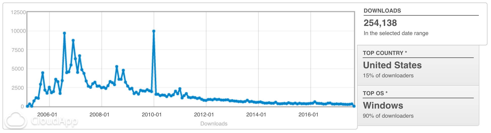

# DM2 aka DialogMate2 

Quick links: [**download**](releases/latest) | [**documentation**](wiki)

    DM2 IS NOT LONGER BEING MAINTAINED. FEEL FREE TO CONTRIBUTE!

**DM2** provides several Windows enhancements that may help in every-day work. One of the nicest and most popular features of **DM2** is minimizing windows to _floating icons®_ (a unique feature!) freeing both task bar and tray bar space. Moreover, **DM2** can manipulate windows in various ways: minimize to tray, make them standing always on-top over all other windows, roll to caption, resize, align to screen borders, hide, set the opacity etc. **DM2** also helps with Open/Save dialog boxes, by providing user-defined menu with favorites and recent files and folders. Plenty of program's settings options will satisfy most of requirements.

And that is not all! **DM2** also supports _custom plugins_, which further enhances the program and that usually covers some more specific functionalities. So, from this aspect, one may think of DM2 as a small, but robust manager for all kind of plugins. Find what you need, plug it in, and use it:)

**DM2** is _free_ for use. Source is released under the terms of the [GPL license](LICENSE).

## Download

The latest **DM2** release is available here:

[**dm2-1.23.1.zip**](releases/latest)

**DM2** is tested on Windows 2K/XP. All archives and binaries are ad-free and virus-free.

Up to the _September 2017._, **DM2** was download more then **250 000** times!

## Documentation

**DM2** documentation is on the [wiki](wiki).

## Development

    DM2 IS NOT LONGER BEING MAINTAINED. FEEL FREE TO CONTRIBUTE!

DM2 project was developed and maintained by following persons:

+ **weird** aka igr
+ **flyfancy** (flyfancy [at] users.sourceforge.net)

**DM2** was developed using Micro$oft Visual Studio v6.0 with SP #6. Also, a recent version of M$ SDK is required for building project successfully.

### Contributors and credits

+ **Henry Spencer**: famous regular expression library.
+ [**scrow**](http://scrow.virtualplastic.net/): nice icon for Open/Save dialogs.
+ **spyder** & **plastic** from [virtualplastic.net](http://virtualplastic.net): ideas and testing.
+ **choval**: ultramon conflict and solution.
+ **gogu**: for NX CPU bug fix

Feel free to contribute! Enhance DM2, write a plugin, translate program, or even correct this bad English:)